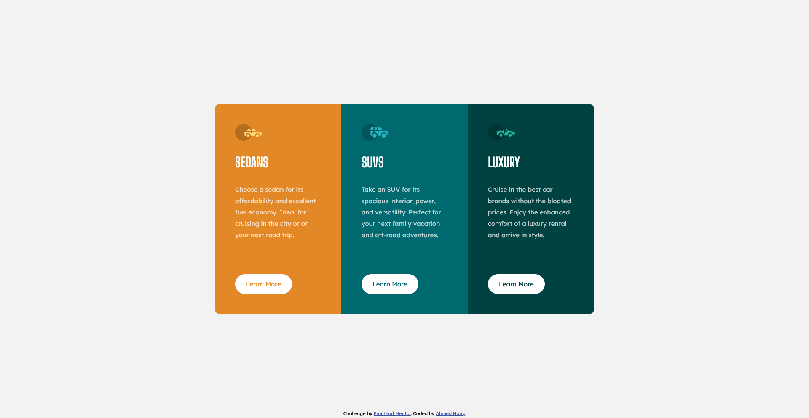

# Frontend Mentor - 3-column preview card component solution

## Table of contents

- [Overview](#overview)
  - [Screenshot](#screenshot)
  - [Links](#links)
- [My process](#my-process)
  - [Built with](#built-with)
  - [Useful resources](#useful-resources)
- [Author](#author)

## Overview

### Screenshot

### Links

- [Solution URL](https://github.com/ahmedhanyh/3-column-preview-card-component)
- [Live Site URL](https://ahmedhanyh.github.io/3-column-preview-card-component)

## My process

### Built with

- Semantic HTML5 markup
- CSS custom properties
- CSS Grid
- Flexbox
- BEM CSS class naming methodology

### Useful resources

- [The Odin Project's CSS Grid section](https://www.theodinproject.com/paths/full-stack-javascript/courses/intermediate-html-and-css#grid) - This guide contains all you need to learn CSS grid.

## Author

- GitHub - [@ahmedhanyh](https://github.com/ahmedhanyh)
- Frontend Mentor - [@ahmedhanyh](https://www.frontendmentor.io/profile/ahmedhanyh)
